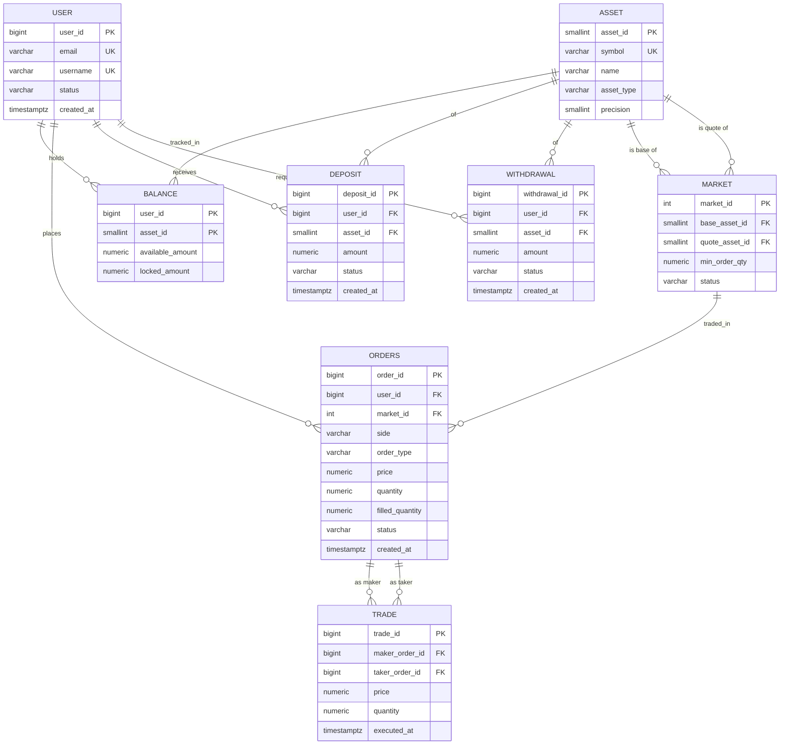

# ER Model, Functional Dependencies, and Normalization

## 1. Entities

| Entity          | Purpose                                                              |
|-----------------|----------------------------------------------------------------------|
| **User**        | A person who uses the exchange                                       |
| **Asset**       | Something tradeable — a fiat currency or a cryptocurrency            |
| **Market**      | An ordered pair of assets `(base, quote)` — e.g. `BTC/USD`           |
| **Balance**     | How much of a given asset a given user holds, split into `available` (spendable) and `locked` (reserved by open orders) |
| **Order**       | A user's intent to buy or sell a quantity of the base asset on a market at a specified limit price |
| **Trade**       | An execution — a match between one buy order and one sell order, transferring a quantity at a price |
| **Deposit**     | An event moving an asset **into** the exchange for a user            |
| **Withdrawal**  | An event moving an asset **out of** the exchange for a user          |


## 2. ER Diagram



Notes on the diagram:

- `ASSET ||--o{ MARKET` appears twice because `Market` has two separate FKs
  to `Asset` (base and quote). The invariant `base ≠ quote` is enforced at
  the schema level (`CHECK`).
- `ORDERS ||--o{ TRADE` appears twice for the same reason: `Trade` references
  `Orders` once as maker and once as taker.
- The name `ORDERS` is plural because `ORDER` is a reserved SQL keyword; we
  use the plural form throughout the physical schema.


## 3. Functional Dependencies per Relation

### 3.1 User(`user_id`, `email`, `username`, `status`, `created_at`)

- `user_id → email, username, status, created_at`
- `email → user_id`
- `username → user_id`

Candidate keys: `{user_id}`, `{email}`, `{username}`.
Prime attributes: `user_id`, `email`, `username`.

**BCNF ✓** — every non-trivial FD has a superkey on the LHS.

---

### 3.2 Asset(`asset_id`, `symbol`, `name`, `asset_type`, `precision`)

- `asset_id → symbol, name, asset_type, precision`
- `symbol → asset_id`

Candidate keys: `{asset_id}`, `{symbol}`. **BCNF ✓**

---

### 3.3 Market(`market_id`, `base_asset_id`, `quote_asset_id`, `min_order_qty`, `status`)

- `market_id → base_asset_id, quote_asset_id, min_order_qty, status`
- `(base_asset_id, quote_asset_id) → market_id`

Candidate keys: `{market_id}`, `{base_asset_id, quote_asset_id}`.
**BCNF ✓**

---

### 3.4 Balance(`user_id`, `asset_id`, `available_amount`, `locked_amount`)

- `(user_id, asset_id) → available_amount, locked_amount`

Candidate key: `{user_id, asset_id}`. **BCNF ✓**

---

### 3.5 Orders(`order_id`, `user_id`, `market_id`, `side`, `order_type`, `price`, `quantity`, `filled_quantity`, `status`, `created_at`)

- `order_id → user_id, market_id, side, order_type, price, quantity, filled_quantity, status, created_at`

Candidate key: `{order_id}`. **BCNF ✓**

> **Note on `filled_quantity`.** This attribute is a cached aggregate — it
> equals the sum of trade quantities for trades where this order was either
> maker or taker. This is a deliberate controlled denormalisation for read
> efficiency, discussed in §5. It is **not** a 3NF violation: functional
> dependencies describe equality within a single relation, not aggregation
> across relations.

---

### 3.6 Trade — the normalisation case study

#### 3.6.1 Naive design (with `market_id`)

`Trade(trade_id, `**`market_id`**`, maker_order_id, taker_order_id, price, quantity, executed_at)`

FDs:

- `trade_id → market_id, maker_order_id, taker_order_id, price, quantity, executed_at`
- `maker_order_id → market_id`   *(via Orders: an order belongs to exactly one market)*
- `taker_order_id → market_id`   *(same reason)*

Candidate key: `{trade_id}`. Prime attributes: `{trade_id}`.

#### 3.6.2 Why this violates 3NF

The FD `maker_order_id → market_id` has:

- an LHS (`maker_order_id`) that is **not a superkey** of `Trade` — it is a
  foreign key, and many trades can share the same maker order (think: a
  large maker order partially filled by several takers); and
- an RHS (`market_id`) that is **not a prime attribute** — it is not part of
  any candidate key of `Trade`.

This is the textbook shape of a 3NF violation: a **transitive dependency**
`trade_id → maker_order_id → market_id`. `market_id` in `Trade` is a
redundancy — it is determined by `maker_order_id`, which is itself
determined by `trade_id`.

#### 3.6.3 Decomposition

We remove `market_id` from `Trade`. When a query needs the market, it
recovers it via a join:

```sql
SELECT t.trade_id, o.market_id
FROM trades t
JOIN orders o ON o.order_id = t.maker_order_id;
```

#### 3.6.4 Final Trade relation

`Trade(trade_id, maker_order_id, taker_order_id, price, quantity, executed_at)`

- `trade_id → maker_order_id, taker_order_id, price, quantity, executed_at`

Candidate key: `{trade_id}`. **BCNF ✓**

#### 3.6.5 Invariants that normalisation does not capture

Two business rules remain that are **not** functional dependencies — they
are inter-row invariants that naturally live in triggers (or `CHECK` with a
subquery, which is non-standard SQL):

1. The maker and taker must belong to the same `market_id`.
2. The maker and taker must be on opposite `side`s (one `BUY`, one `SELL`).

These are enforced by the trigger `trg_validate_trade` in `sql/01_schema.sql`.
This distinction — between what FD-driven normalisation guarantees and what
requires triggers — is itself a good point to make in the report.

---

### 3.7 Deposit(`deposit_id`, `user_id`, `asset_id`, `amount`, `status`, `created_at`)

- `deposit_id → user_id, asset_id, amount, status, created_at`

Candidate key: `{deposit_id}`. **BCNF ✓**

---

### 3.8 Withdrawal(`withdrawal_id`, `user_id`, `asset_id`, `amount`, `status`, `created_at`)

Same shape as `Deposit`. **BCNF ✓**


## 4. Normalisation outcome — summary table

| Relation            | Candidate keys                                           | Normal form |
|---------------------|----------------------------------------------------------|-------------|
| User                | `{user_id}`, `{email}`, `{username}`                     | BCNF        |
| Asset               | `{asset_id}`, `{symbol}`                                 | BCNF        |
| Market              | `{market_id}`, `{base_asset_id, quote_asset_id}`         | BCNF        |
| Balance             | `{user_id, asset_id}`                                    | BCNF        |
| Orders              | `{order_id}`                                             | BCNF        |
| Trade (naive)       | `{trade_id}`                                             | **not 3NF** |
| Trade (decomposed)  | `{trade_id}`                                             | BCNF        |
| Deposit             | `{deposit_id}`                                           | BCNF        |
| Withdrawal          | `{withdrawal_id}`                                        | BCNF        |

All final relations are in BCNF after the single decomposition step in §3.6.


## 5. Controlled denormalisation — explicit acknowledgement

Two places in the schema keep cached / derived values for read efficiency.
We surface them here honestly rather than pretending the schema is
"perfectly normalised":

1. **`orders.filled_quantity`** — equals
   `SUM(quantity)` over `trades` where this order is maker or taker.
   Cached to avoid an aggregation on every order-status read.

2. **`balances.locked_amount`** — equals, for this `(user, asset)` pair, the
   sum over the user's open orders on markets where this asset is the
   "locked" side, of the reserved quantity.

Both caches are maintained by application logic (the order-placement and
trade-settlement procedures implemented in Layer 5). Their consistency with
the underlying facts is a system invariant that we will test explicitly —
it is exactly the kind of invariant that concurrency bugs break.


## 6. From entities to the physical schema

The physical names (plural, lowercase) used in `sql/01_schema.sql`:

| Entity      | Table name     |
|-------------|----------------|
| User        | `users`        |
| Asset       | `assets`       |
| Market      | `markets`      |
| Balance     | `balances`     |
| Order       | `orders`       |
| Trade       | `trades`       |
| Deposit     | `deposits`     |
| Withdrawal  | `withdrawals`  |

See `sql/01_schema.sql` for the DDL and `sql/02_seed_small.sql` for a hand-verifiable
seed dataset.
